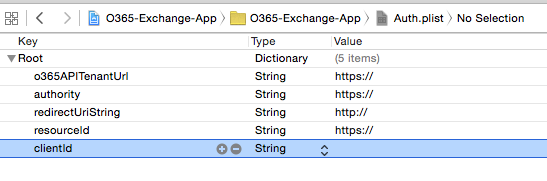
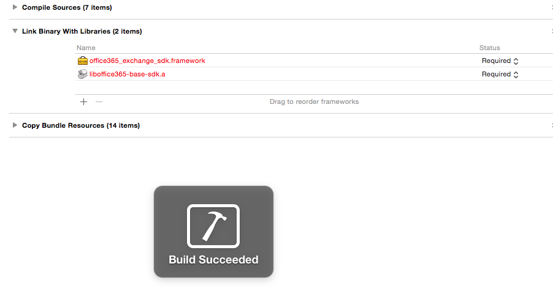

Module XX: *Manage Exchange mailbox in a O365 tenant with iOS*
==========================

##Overview

The lab lets students use an AzureAD account to manage an Exchange mailbox in a O365 tenant with an iOS app.

##Objectives

- Learn how to create a client for O365 to manage an Exchange mailbox
- Learn how to add features to list folders and messages

##Prerequisites

- Apple Macintosh environment
- XCode 6 (from the AppStore - compatible with iOS8 sdk)
- XCode developer tools (it will install git integration from XCode and the terminal)
- You must have a Windows Azure subscription to complete this lab.
- You must have completed Module 04 and linked your Azure subscription with your O365 tenant.

##Exercises

The hands-on lab includes the following exercises:

- [Add O365 iOS Exchange sdk library to the project](#exercise1)
- [Create a Client class for all operations](#exercise2)
- [Connect actions in the view to ExchangeClient class](#exercise3)

<a name="exercise1"></a>
##Exercise 1: Add O365 iOS Exchange sdk library to a project
In this exercise you will use an existing application with the AzureAD authentication included, to add the O365 Exchange sdk library in the project
and create a client class with empty methods in it to handle the requests to the Outlook tenant.

###Task 1 - Open the Project
01. Download the starting point App:

    ```
    git clone 
    ```

02. Open the **.xcodeproj** file in the O365-Exchange-App

03. Find and Open the **Auth.plist** file.

04. Fill the AzureAD account settings in the properties
    
    

03. Build and Run the project in an iOS Simulator to check the views

    ```
    Application:
    You will se a login page with buttons to access the application and to clear credentials.
    Once authenticated, the mailbox folders list will appear with one fake entry. Selecting one,
    you will see the emails inside the folder, and also check each email.

    Environment:
    With the credentials settings we can access to the client user mailbox through the Outlook 
    Exchange tenant, and will be able to implement every single details of a complete email app,
    only using the O365-Exchange sdk
    ```

    

###Task 2 - Import the library
01. Download a copy of the library using the terminal:

    ```
    git clone 
    ```

02. Open the downloaded folder and copy **office365_exchange_sdk**, **office365_odata_base**, **office365_odata_impl** and **office365_odata_interfaces** folders under **Sdk-ObjectiveC**. Paste it in a lib folder inside our project path.

    

03. Drag the **office365-exchange-sdk.xcodeproj** file into XCode under our application project.
    
    

05. Go to project settings selecting the first file from the files explorer. Then click on **Build Phases** and add an entry in the **Target Dependencies** section.

    

06. Select the **office365-exchange-sdk** library dependency.

    

07. Under **Link Binary with Libraries** add an entry pointing to **office365_exchange_sdk.framework** file

     

08. Build and Run the application to check everything is ok.

    

<a name="exercise2"></a>
##Exercise 2: Create a Client class for all operations
In this exercise you will create a client class for all the operations related to Projects and References. This class will connect to the **office365-lists-sdk**
and do some parsing and JSON handling

###Task 1 - Create a client class to connect to the o365-lists-sdk

01. On the XCode files explorer, under the group **ResearchProjectTrackerApp** you will se a **client** empty folder. Also under **ResearchProjectTrackerExtension/Supporting Files**
you have another **client** folder.

    

02. On the firt one, make a right click in the client folder and select **New File**. You will see the **New File wizard**. Click on the **iOS** section, select **Cocoa Touch Class** and click **Next**.

    

03. In this section, configure the new class giving it a name (**ProjectClient**), and make it a subclass of **ListClient**. Make sure that the language dropdown is set with **Objective-C** because our o365-lists library is written in that programming language. Finally click on **Next**.

        

04. Now we are going to select where the new class sources files (.h and .m) will be stored. In this case we can click on **Create** directly. This will create a **.h** and **.m** files for our new class.

    

05. Do the same for the other **client** folder under the **ResearchProjectTrackerExtension** in order to create the **ProjectClientEx** class, but in the last step of the wizard, change the target, to add visibility to this scope.

    

06. Now you will have a file structure like this:

    

07. Build the Project and you will see 2 errors. To fix them change the import sentences On **ProjectClient.h** and **ProjectClientEx.m**.

    From :
    ```
    #import "ListClient.h"
    ```

    To:
    ```
    #import <office365-lists-sdk/ListClient.h>
    ```

08. Re-build the project and check everything is ok.


###Task 2 - Add ProjectClient methods

01. Open the **ProjectClient.h** class and then add the following between **@interface** and **@end**

    ```
    - (NSURLSessionDataTask *)addProject:(ListItem *)listItem callback: (void (^)(BOOL success, NSError *error))callback;
    - (NSURLSessionDataTask *)updateProject:(ListItem *)project callback:(void (^)(BOOL, NSError *))callback;
    - (NSURLSessionDataTask *)updateReference:(ListItem *)reference callback:(void (^)(BOOL, NSError *))callback;
    - (NSURLSessionDataTask *)addReference:(ListItem *)reference callback: (void (^)(BOOL success, NSError *error))callback;
    - (NSURLSessionDataTask *)getReferencesByProjectId:(NSString *)projectId callback:(void (^)(NSMutableArray *listItems, NSError *error))callback;
    - (NSURLSessionDataTask *)deleteListItem:(NSString *)name itemId:(NSString *)itemId callback:(void (^)(BOOL result, NSError *error))callback;
    +(ProjectClient*)getClient: (NSString *) token;
    ```

    Each method is responsible of retrieve data from the O365 tenant and parse it, or manage add, edit, delete actions.
    Also add the import sentence:

    ```
    #import <office365-lists-sdk/ListItem.h>
    ```

02. Add the body of each method in the **ProjectClient.m** file.

    Add Project
    ```
    const NSString *apiUrl = @"/_api/lists";

- (NSURLSessionDataTask *)addProject:(ListItem *)listItem callback:(void (^)(BOOL, NSError *))callback
{
    NSString *url = [NSString stringWithFormat:@"%@%@/GetByTitle('%@')/Items", self.Url , apiUrl, [@"Research Projects" urlencode]];
    
    NSString *json = [[NSString alloc] init];
    json = @"{ 'Title': '%@'}}";
    
    NSString *formatedJson = [NSString stringWithFormat:json, [listItem getTitle]];
    
    NSData *jsonData = [formatedJson dataUsingEncoding: NSUTF8StringEncoding];
    
    HttpConnection *connection = [[HttpConnection alloc] initWithCredentials:self.Credential
                                                                         url:url
                                                                   bodyArray: jsonData];
    
    NSString *method = (NSString*)[[Constants alloc] init].Method_Post;
    
    return [connection execute:method callback:^(NSData  *data, NSURLResponse *reponse, NSError *error) {
        ListItem *list;
        
        if(error == nil){
            list = [[ListItem alloc] initWithJson:data];
        }
        
        callback(list, error);
    }];
}
    ```

    Update Project
    ```
- (NSURLSessionDataTask *)updateProject:(ListItem *)project callback:(void (^)(BOOL, NSError *))callback
{
    NSString *url = [NSString stringWithFormat:@"%@%@/GetByTitle('%@')/Items(%@)", self.Url , apiUrl, [@"Research Projects" urlencode], project.Id];
    
    NSString *json = [[NSString alloc] init];
    json = @"{ 'Title': '%@'}";
    
    NSString *formatedJson = [NSString stringWithFormat:json, [project getTitle]];
    
    NSData *jsonData = [formatedJson dataUsingEncoding: NSUTF8StringEncoding];
    
    NSMutableURLRequest *theRequest=[NSMutableURLRequest requestWithURL:[NSURL URLWithString:url]];
    
    [theRequest setHTTPMethod:@"POST"];
    [theRequest setValue:@"application/json" forHTTPHeaderField:@"Content-Type"];
    [theRequest setValue:@"MERGE" forHTTPHeaderField:@"X-HTTP-Method"];
    [theRequest setValue:@"*" forHTTPHeaderField:@"IF-MATCH"];
    [theRequest setHTTPBody:jsonData];
    [self.Credential prepareRequest:theRequest];
    
    
    NSURLResponse * response = nil;
    NSError * error = nil;
    NSData * data = [NSURLConnection sendSynchronousRequest:theRequest
                                          returningResponse:&response
                                                      error:&error];
    
    NSDictionary *jsonResult = [NSJSONSerialization JSONObjectWithData:data
                                                               options: NSJSONReadingMutableContainers
                                                                 error:nil];
    NSString *myString = [[NSString alloc] initWithData:data encoding:NSUTF8StringEncoding];
    
    callback((!jsonResult && [myString isEqualToString:@""]), error);

    return 0;
}
    ```

    Update Reference
    ```
- (NSURLSessionDataTask *)updateReference:(ListItem *)reference callback:(void (^)(BOOL, NSError *))callback
{
    NSString *url = [NSString stringWithFormat:@"%@%@/GetByTitle('%@')/Items(%@)", self.Url , apiUrl, [@"Research References" urlencode], reference.Id];
    
    NSString *json = [[NSString alloc] init];
    json = @"{ 'Comments': '%@', 'URL':{'Url':'%@', 'Description':'%@'}}";
    
    NSDictionary *dic =[reference getData:@"URL"];
    NSString *refUrl = [dic valueForKey:@"Url"];
    NSString *refTitle = [dic valueForKey:@"Description"];
    
    NSString *formatedJson = [NSString stringWithFormat:json, [reference getData:@"Comments"], refUrl, refTitle];
    
    NSData *jsonData = [formatedJson dataUsingEncoding: NSUTF8StringEncoding];
    
    NSMutableURLRequest *theRequest=[NSMutableURLRequest requestWithURL:[NSURL URLWithString:url]];
    
    [theRequest setHTTPMethod:@"POST"];
    [theRequest setValue:@"application/json" forHTTPHeaderField:@"Content-Type"];
    [theRequest setValue:@"MERGE" forHTTPHeaderField:@"X-HTTP-Method"];
    [theRequest setValue:@"*" forHTTPHeaderField:@"IF-MATCH"];
    [theRequest setHTTPBody:jsonData];
    [self.Credential prepareRequest:theRequest];
    
    
    NSURLResponse * response = nil;
    NSError * error = nil;
    NSData * data = [NSURLConnection sendSynchronousRequest:theRequest
                                          returningResponse:&response
                                                      error:&error];
    
    NSDictionary *jsonResult = [NSJSONSerialization JSONObjectWithData:data
                                                               options: NSJSONReadingMutableContainers
                                                                 error:nil];
    NSString *myString = [[NSString alloc] initWithData:data encoding:NSUTF8StringEncoding];
    
    callback((!jsonResult && [myString isEqualToString:@""]), error);
    
    return 0;
}
    ```

    Add Reference
    ```
- (NSURLSessionDataTask *)addReference:(ListItem *)reference callback:(void (^)(BOOL, NSError *))callback
{
    NSString *url = [NSString stringWithFormat:@"%@%@/GetByTitle('%@')/Items", self.Url , apiUrl, [@"Research References" urlencode]];
    
    NSString *json = [[NSString alloc] init];
    json = @"{ 'URL': %@, 'Comments':'%@', 'Project':'%@'}";
    
    NSString *formatedJson = [NSString stringWithFormat:json, [reference getData:@"URL"], [reference getData:@"Comments"], [reference getData:@"Project"]];
    
    NSData *jsonData = [formatedJson dataUsingEncoding: NSUTF8StringEncoding];
    
    HttpConnection *connection = [[HttpConnection alloc] initWithCredentials:self.Credential
                                                                         url:url
                                                                   bodyArray: jsonData];
    
    NSString *method = (NSString*)[[Constants alloc] init].Method_Post;
    
    return [connection execute:method callback:^(NSData  *data, NSURLResponse *reponse, NSError *error) {
        ListEntity *list;
        
        if(error == nil){
            list = [[ListEntity alloc] initWithJson:data];
        }
        
        callback(list, error);
    }];
}
    ```

    Get References by Project
    ```
- (NSURLSessionDataTask *)getReferencesByProjectId:(NSString *)projectId callback:(void (^)(NSMutableArray *listItems, NSError *error))callback{
    NSString *queryString = [NSString stringWithFormat:@"Project eq '%@'", projectId];
    NSString *url = [NSString stringWithFormat:@"%@%@/GetByTitle('%@')/Items?$filter=%@", self.Url , apiUrl, [@"Research References" urlencode], [queryString urlencode]];
    HttpConnection *connection = [[HttpConnection alloc] initWithCredentials:self.Credential url:url];
    
    NSString *method = (NSString*)[[Constants alloc] init].Method_Get;
    
    return [connection execute:method callback:^(NSData *data, NSURLResponse *response, NSError *error) {
        NSDictionary *jsonResult = [NSJSONSerialization JSONObjectWithData:data
                                                                   options: NSJSONReadingMutableContainers
                                                                     error:nil];
        
        NSMutableArray *array = [NSMutableArray array];
        
        NSMutableArray *listsItemsArray =[self parseDataArray: data];
        for (NSDictionary* value in listsItemsArray) {
            [array addObject: [[ListItem alloc] initWithDictionary:value]];
        }
        
        callback(array ,error);
    }];
}
    ```

    Delete an Item
    ```
- (NSURLSessionDataTask *)deleteListItem:(NSString *)name itemId:(NSString *)itemId callback:(void (^)(BOOL result, NSError *error))callback{
    
    //NSString *queryString = [NSString stringWithFormat:@"filter=Id eq '%@'", itemId];
    NSString *url = [NSString stringWithFormat:@"%@%@/GetByTitle('%@')/Items(%@)", self.Url , apiUrl, [name urlencode], itemId];
    
    
    HttpConnection *connection = [[HttpConnection alloc] initWithCredentials:self.Credential
                                                                         url:url
                                                                   bodyArray: nil];
    
    NSString *method = (NSString*)[[Constants alloc] init].Method_Delete;
    
    return [connection execute:method callback:^(NSData  *data, NSURLResponse *reponse, NSError *error) {
        
        NSDictionary *jsonResult = [NSJSONSerialization JSONObjectWithData:data
                                                                   options: NSJSONReadingMutableContainers
                                                                     error:nil];
        
        BOOL result = FALSE;
        
        if(error == nil && [data length] == 0 ){
            result = TRUE;
        }
        
        callback(result, error);
    }];
}
    ```

03. Add the **JSON** handling methods:

    Parsing Results
    ```
    - (NSMutableArray *)parseDataArray:(NSData *)data{
    
    NSMutableArray *array = [NSMutableArray array];
    
    NSError *error ;
    
    NSDictionary *jsonResult = [NSJSONSerialization JSONObjectWithData:[self sanitizeJson:data]
                                                               options: NSJSONReadingMutableContainers
                                                                 error:&error];
    
    NSArray *jsonArray = [[jsonResult valueForKey : @"d"] valueForKey : @"results"];
    
    if(jsonArray != nil){
        for (NSDictionary *value in jsonArray) {
            [array addObject: value];
        }
    }else{
        NSDictionary *jsonItem =[jsonResult valueForKey : @"d"];
        
        if(jsonItem != nil){
            [array addObject:jsonItem];
        }
    }
    
    return array;
}
    ```

    Sanitizing JSON
    ```
 - (NSData*) sanitizeJson : (NSData*) data{
    NSString * dataString = [[NSString alloc ] initWithData:data encoding:NSUTF8StringEncoding];
    
    NSString* replacedDataString = [dataString stringByReplacingOccurrencesOfString:@"E+308" withString:@"E+127"];
    
    NSData* bytes = [replacedDataString dataUsingEncoding:NSUTF8StringEncoding];
    
    return bytes;
}
    ```

04. Add the **getClient** class method

    ```
    +(ProjectClient*)getClient: (NSString *) token{
    OAuthentication* authentication = [OAuthentication alloc];
    [authentication setToken:token];
    
    return [[ProjectClient alloc] initWithUrl:@"https://xxx.xxx/xxx"
                                  credentials: authentication];
    }
    ```

    ```
    Make sure to change https://xxx.xxx/xxx with the Resource url in the 
    initWithUrl:credentials: method.
    ```

05. Add the following import sentences:

    ```
    #import "office365-base-sdk/HttpConnection.h"
    #import "office365-base-sdk/Constants.h"
    #import "office365-base-sdk/NSString+NSStringExtensions.h"
    #import "office365-base-sdk/OAuthentication.h"
    ```

06. Build the project and check everything is ok.

07. In **ProjectClientEx.h** header file, add the following declaration between **@interface** and **@end**

    ```
    - (NSURLSessionDataTask *)addReference:(ListItem *)reference callback: (void (^)(BOOL success, NSError *error))callback;
    +(ProjectClientEx*)getClient: (NSString *) token;
    ```
    And the import sentence:
    ```
    #import "office365-lists-sdk/ListItem.h"
    ```

08. Now on **ProjectClientEx.m** add the method body:

    ```
const NSString *apiUrl = @"/_api/lists";

- (NSURLSessionDataTask *)addReference:(ListItem *)reference callback:(void (^)(BOOL, NSError *))callback
{
    NSString *url = [NSString stringWithFormat:@"%@%@/GetByTitle('%@')/Items", self.Url , apiUrl, [@"Research References" urlencode]];
    
    NSString *json = [[NSString alloc] init];
    json = @"{ 'URL': %@, 'Comments':'%@', 'Project':'%@'}";
    
    NSString *formatedJson = [NSString stringWithFormat:json, [reference getData:@"URL"], [reference getData:@"Comments"], [reference getData:@"Project"]];
    
    NSData *jsonData = [formatedJson dataUsingEncoding: NSUTF8StringEncoding];
    
    HttpConnection *connection = [[HttpConnection alloc] initWithCredentials:self.Credential
                                                                         url:url
                                                                   bodyArray: jsonData];
    
    NSString *method = (NSString*)[[Constants alloc] init].Method_Post;
    
    return [connection execute:method callback:^(NSData  *data, NSURLResponse *reponse, NSError *error) {
        ListEntity *list;
        
        if(error == nil){
            list = [[ListEntity alloc] initWithJson:data];
        }
        
        callback(list, error);
    }];
    return 0;
}
    ```

09. Add the **JSON** handling methods:

    Parsing Results
    ```
    - (NSMutableArray *)parseDataArray:(NSData *)data{
    
    NSMutableArray *array = [NSMutableArray array];
    
    NSError *error ;
    
    NSDictionary *jsonResult = [NSJSONSerialization JSONObjectWithData:[self sanitizeJson:data]
                                                               options: NSJSONReadingMutableContainers
                                                                 error:&error];
    
    NSArray *jsonArray = [[jsonResult valueForKey : @"d"] valueForKey : @"results"];
    
    if(jsonArray != nil){
        for (NSDictionary *value in jsonArray) {
            [array addObject: value];
        }
    }else{
        NSDictionary *jsonItem =[jsonResult valueForKey : @"d"];
        
        if(jsonItem != nil){
            [array addObject:jsonItem];
        }
    }
    
    return array;
}
    ```

    Sanitizing JSON
    ```
 - (NSData*) sanitizeJson : (NSData*) data{
    NSString * dataString = [[NSString alloc ] initWithData:data encoding:NSUTF8StringEncoding];
    
    NSString* replacedDataString = [dataString stringByReplacingOccurrencesOfString:@"E+308" withString:@"E+127"];
    
    NSData* bytes = [replacedDataString dataUsingEncoding:NSUTF8StringEncoding];
    
    return bytes;
}
    ```

10. Add the **getClient** class method:

    ```
+(ProjectClientEx*)getClient: (NSString *) token{
    OAuthentication* authentication = [OAuthentication alloc];
    [authentication setToken:token];
    
    return [[ProjectClientEx alloc] initWithUrl:@"https://xxx.xxx/xxx"
                                  credentials: authentication];
}
    ```

    ```
    Make sure to change https://xxx.xxx/xxx with the Resource url in the 
    initWithUrl:credentials: method.
    ```

11. Add the following import sentences on **ProjectClientEx.m**

    ```
#import "office365-base-sdk/HttpConnection.h"
#import "office365-base-sdk/Constants.h"
#import "office365-base-sdk/NSString+NSStringExtensions.h"
#import "office365-base-sdk/OAuthentication.h"
    ```

12. Build and Run the application and check everything is ok.

<a name="exercise3"></a>
##Exercise 3: Connect actions in the view to ProjectClient class
In this exercise you will navigate in every controller class of the project, in order to connect each action (from buttons, lists and events) with one ProjectClient operation.

```
The Application has every event wired up with their respective controller classes. 
We need to connect this event methods to our ProjectClient/ProjectClientEx class 
in order to have access to the o365-lists-sdk.
```

###Task1 - Wiring up ProjectTableView

01. Take a look to the **ProjectTableViewController.m** class implementation. More especifically, the **loadData** method.

    

    ```
    This empty method shows how we use the spinner and then call the data function, 
    delegating in this method the data gathering and spinner stop.

    All the calls to the O365 client begins creating a NSURLSessionTask that will
    be executed asyncronously and then call to a callback block that will change the view
    and to show the data or an error message, also in an async way, putting all the changes
    in the Execution Main Queue, using:
    ```

    ```
    dispatch_async(dispatch_get_main_queue(), ^{
        //changes to the view
    }
    ```

02. Add the **loadData** method body:

    ```
    -(void)loadData{
    //Create and add a spinner
    UIActivityIndicatorView* spinner = [[UIActivityIndicatorView alloc]initWithFrame:CGRectMake(135,140,50,50)];
    spinner.activityIndicatorViewStyle = UIActivityIndicatorViewStyleGray;
    [self.view addSubview:spinner];
    spinner.hidesWhenStopped = YES;
    [spinner startAnimating];
    
    ProjectClient* client = [ProjectClient getClient:self.token];
    
   NSURLSessionTask* task = [client getList:@"Research Projects" callback:^(ListEntity *list, NSError *error) {
        
    //If list doesn't exists, create one with name Research Projects
   if(list){
            dispatch_async(dispatch_get_main_queue(), ^{
                [self getProjectsFromList:spinner];
            });
        }else{
            dispatch_async(dispatch_get_main_queue(), ^{
                [self createProjectList:spinner];
            });
        }
        
    }];
    [task resume];
}
    ```

03. Add the body for the **getProjectsFromList** and **createProjectList** methods

    Get Projects
    ```
    -(void)getProjectsFromList:(UIActivityIndicatorView *) spinner{
    ProjectClient* client = [ProjectClient getClient:self.token];
    
    NSURLSessionTask* listProjectsTask = [client getListItems:@"Research Projects" callback:^(NSMutableArray *listItems, NSError *error) {
        if(!error){
            self.projectsList = listItems;
            
            dispatch_async(dispatch_get_main_queue(), ^{
                [self.tableView reloadData];
                [spinner stopAnimating];
            });
        }
    }];
    [listProjectsTask resume];
}
    ```

    Create Project List
    ```
-(void)createProjectList:(UIActivityIndicatorView *) spinner{
    ProjectClient* client = [ProjectClient getClient:self.token];
    
    ListEntity* newList = [[ListEntity alloc ] init];
    [newList setTitle:@"Research Projects"];
    
    NSURLSessionTask* createProjectListTask = [client createList:newList :^(ListEntity *list, NSError *error) {
        [spinner stopAnimating];
    }];
    [createProjectListTask resume];
}
    ```

04. Now fill the table with the projects information

    ```
    - (UITableViewCell *)tableView:(UITableView *)tableView cellForRowAtIndexPath:(NSIndexPath *)indexPath
{
    NSString* identifier = @"ProjectListCell";
    ProjectTableViewCell *cell =[tableView dequeueReusableCellWithIdentifier: identifier ];
    
    ListItem *item = [self.projectsList objectAtIndex:indexPath.row];
    cell.ProjectName.text = [item getTitle];
    
    return cell;
}
    ```

05. Get projects count
    
    ```
    - (NSInteger)tableView:(UITableView *)tableView numberOfRowsInSection:(NSInteger)section
{
    return [self.projectsList count];
}
    ```

06. Row selection
    
    ```
    - (void)tableView:(UITableView *)tableView didSelectRowAtIndexPath:(NSIndexPath *)indexPath
{
    currentEntity= [self.projectsList objectAtIndex:indexPath.row];
    
    [self performSegueWithIdentifier:@"detail" sender:self];
}
    ```

07. Set the selectedProject when navigate forward

    ```
    - (void)prepareForSegue:(UIStoryboardSegue *)segue sender:(id)sender
{
    if([segue.identifier isEqualToString:@"newProject"]){
        CreateViewController *controller = (CreateViewController *)segue.destinationViewController;
        controller.token = self.token;
    }else{
        ProjectDetailsViewController *controller = (ProjectDetailsViewController *)segue.destinationViewController;
        //controller.project = currentEntity;
        controller.token = self.token;
    }
    
}
    ```

08. Add the instance variable for the selected project:

    ```
    ListItem* currentEntity;
    ```

09. Add the import sentence for the ProjectClient class

    ```
    #import "ProjectClient.h"
    ```

10. Build and Run the app, and check everything is ok. You will see the project lists in the main screen

    

###Task2 - Wiring up CreateProjectView

01. Open **CreateViewController.m** and add the body to the **createProject** method

    ```
    -(void)createProject{
    if(![self.FileNameTxt.text isEqualToString:@""]){
        UIActivityIndicatorView* spinner = [[UIActivityIndicatorView alloc]initWithFrame:CGRectMake(135,140,50,50)];
        spinner.activityIndicatorViewStyle = UIActivityIndicatorViewStyleGray;
        [self.view addSubview:spinner];
        spinner.hidesWhenStopped = YES;
        
        [spinner startAnimating];
        
        ProjectClient* client = [ProjectClient getClient:self.token];
        
        ListItem* newProject = [[ListItem alloc] init];
        
        NSDictionary* dic = [NSDictionary dictionaryWithObjects:@[@"Title",self.FileNameTxt.text] forKeys:@[@"_metadata",@"Title"]];
        [newProject initWithDictionary:dic];
        
        NSURLSessionTask* task = [client addProject:newProject callback:^(BOOL success, NSError *error) {
            if(error == nil){
                dispatch_async(dispatch_get_main_queue(), ^{
                    [spinner stopAnimating];
                    [self.navigationController popViewControllerAnimated:YES];
                });
            }else{
                NSString *errorMessage = [@"Add Project failed. Reason: " stringByAppendingString: error.description];
                UIAlertView *alert = [[UIAlertView alloc] initWithTitle:@"Error" message:errorMessage delegate:self cancelButtonTitle:@"Retry" otherButtonTitles:@"Cancel", nil];
                [alert show];
            }
        }];
        [task resume];
    }else{
        dispatch_async(dispatch_get_main_queue(), ^{
            UIAlertView *alert = [[UIAlertView alloc] initWithTitle:@"Error" message:@"Complete all fields" delegate:self cancelButtonTitle:@"Ok" otherButtonTitles:nil, nil];
            [alert show];
        });
    }
}
    ```

02. Add the import sentence to the **ProjectClient** class

    ```
    #import "ProjectClient.h"
    ```

03. Build and Run the app, and check everything is ok. Now you can create a new project with the plus button in the left corner of the main screen

    


###Task3 - Wiring up ProjectDetailsView

01. Open **ProjectDetailsViewController.h** and add the following variables

    ```
    @property ListItem* project;
    @property ListItem* selectedReference;
    ```

    And add the import sentence
    ```
    #import "office365-lists-sdk/ListItem.h"
    ```

02. Set the value when the user selects a project in the list. On **ProjectTableViewController.m**

    Uncomment this line in the **prepareForSegue:sender:** method
    ```
    //controller.project = currentEntity;
    ```

03. Back to the **ProjectDetailsViewController.m** Set the fields and screen title text on the **viewDidLoad** method

    ```
    -(void)viewDidLoad{
    self.projectName.text = self.project.getTitle;
    self.navigationItem.title = self.project.getTitle;
    self.navigationItem.rightBarButtonItem.title = @"Done";
    self.selectedReference = false;
    self.projectNameField.hidden = true;
    
    
    [self loadData];
    }
    ```

04. Load the references

    Load data method
    ```
    -(void)loadData{
    //Create and add a spinner
    UIActivityIndicatorView* spinner = [[UIActivityIndicatorView alloc]initWithFrame:CGRectMake(135,140,50,50)];
    spinner.activityIndicatorViewStyle = UIActivityIndicatorViewStyleGray;
    [self.view addSubview:spinner];
    spinner.hidesWhenStopped = YES;
    [spinner startAnimating];
    
    ProjectClient* client = [ProjectClient getClient:self.token];
    
    NSURLSessionTask* task = [client getList:@"Research References" callback:^(ListEntity *list, NSError *error) {
        
        //If list doesn't exists, create one with name Research References
        if(list){
            dispatch_async(dispatch_get_main_queue(), ^{
                [self getReferences:spinner];
            });
        }else{
            dispatch_async(dispatch_get_main_queue(), ^{
                [self createReferencesList:spinner];
            });
        }
        
    }];
    [task resume];
    
}
    ```

    Get References Method
    ```
        -(void)getReferences:(UIActivityIndicatorView *) spinner{
    ProjectClient* client = [ProjectClient getClient:self.token];
    
    NSURLSessionTask* listReferencesTask = [client getReferencesByProjectId:self.project.Id callback:^(NSMutableArray *listItems, NSError *error) {
            dispatch_async(dispatch_get_main_queue(), ^{
                self.references = [listItems copy];
                [self.refencesTable reloadData];
                [spinner stopAnimating];
            });
        
        }];

    [listReferencesTask resume];
}
    ```

    Create References Lists if not exists
    ```
    -(void)createReferencesList:(UIActivityIndicatorView *) spinner{
    ProjectClient* client = [ProjectClient getClient:self.token];
    
    ListEntity* newList = [[ListEntity alloc ] init];
    [newList setTitle:@"Research References"];
    
    NSURLSessionTask* createProjectListTask = [client createList:newList :^(ListEntity *list, NSError *error) {
        [spinner stopAnimating];
    }];
    [createProjectListTask resume];
}
    ```

05. Fill the table cells

    ```
    - (UITableViewCell *)tableView:(UITableView *)tableView cellForRowAtIndexPath:(NSIndexPath *)indexPath
{
    NSString* identifier = @"referencesListCell";
    ReferencesTableViewCell *cell =[tableView dequeueReusableCellWithIdentifier: identifier ];
    
    ListItem *item = [self.references objectAtIndex:indexPath.row];
    NSDictionary *dic =[item getData:@"URL"];
    cell.titleField.text = [dic valueForKey:@"Description"];
    cell.urlField.text = [dic valueForKey:@"Url"];
    
    return cell;
}
    ```

06. Get the references count
    
    ```
    - (NSInteger)tableView:(UITableView *)tableView numberOfRowsInSection:(NSInteger)section
{
    return [self.references count];
}
    ```

07. Row selection

    ```
    - (void)tableView:(UITableView *)tableView didSelectRowAtIndexPath:(NSIndexPath *)indexPath
{
    self.selectedReference= [self.references objectAtIndex:indexPath.row];    
    [self performSegueWithIdentifier:@"referenceDetail" sender:self];
}
    ```

08. Forward navigation

    ```
    - (void)prepareForSegue:(UIStoryboardSegue *)segue sender:(id)sender
{
    if([segue.identifier isEqualToString:@"createReference"]){
        CreateReferenceViewController *controller = (CreateReferenceViewController *)segue.destinationViewController;
        controller.project = self.project;
        controller.token = self.token;
    }else if([segue.identifier isEqualToString:@"referenceDetail"]){
        ReferenceDetailsViewController *controller = (ReferenceDetailsViewController *)segue.destinationViewController;
        controller.selectedReference = self.selectedReference;
        controller.token = self.token;
    }else if([segue.identifier isEqualToString:@"editProject"]){
        EditProjectViewController *controller = (EditProjectViewController *)segue.destinationViewController;
        controller.project = self.project;
        controller.token = self.token;
    }
    self.selectedReference = false;
}
    ```

    ```
    - (BOOL)shouldPerformSegueWithIdentifier:(NSString *)identifier sender:(id)sender{
    return ([identifier isEqualToString:@"referenceDetail"] && self.selectedReference) || [identifier isEqualToString:@"createReference"] || [identifier isEqualToString:@"editProject"];
}
    ```

09. Add the import sentence to the **ProjectClient** class

    ```
    #import "ProjectClient.h"
    ```

10. Build and Run the app, and check everything is ok. Now you can see the references from a project

    

###Task4 - Wiring up EditProjectView

01. Adding a variable for the selected project 

    First, add a variable **project** in the **EditProjectViewController.h**
    ```
    @property ListItem* project;
    ```

    And the import sentence
    ```
    #import "office365-lists-sdk/ListItem.h"
    ```

02. On the **ProjectDetailsViewController.m**, uncomment this line in the **prepareForSegue:sender:** method

    ```
    //controller.project = self.project;
    ```

03. Back to **EditProjectViewController.m**. Add the body for **updateProject**

    ```
    -(void)updateProject{
    if(![self.ProjectNameTxt.text isEqualToString:@""]){
        UIActivityIndicatorView* spinner = [[UIActivityIndicatorView alloc]initWithFrame:CGRectMake(135,140,50,50)];
        spinner.activityIndicatorViewStyle = UIActivityIndicatorViewStyleGray;
        [self.view addSubview:spinner];
        spinner.hidesWhenStopped = YES;
        
        [spinner startAnimating];
        
        ListItem* editedProject = [[ListItem alloc] init];
        
        NSDictionary* dic = [NSDictionary dictionaryWithObjects:@[@"Title",self.ProjectNameTxt.text, self.project.Id] forKeys:@[@"_metadata",@"Title",@"Id"]];
        [editedProject initWithDictionary:dic];
        
        ProjectClient* client = [ProjectClient getClient:self.token];
        
        NSURLSessionTask* task = [client updateProject:editedProject callback:^(BOOL result, NSError *error) {
            if(error == nil){
                dispatch_async(dispatch_get_main_queue(), ^{
                    [spinner stopAnimating];
                    ProjectTableViewController *View = [self.navigationController.viewControllers objectAtIndex:self.navigationController.viewControllers.count-3];
                    [self.navigationController popToViewController:View animated:YES];
                });
            }else{
                NSString *errorMessage = [@"Update Project failed. Reason: " stringByAppendingString: error.description];
                UIAlertView *alert = [[UIAlertView alloc] initWithTitle:@"Error" message:errorMessage delegate:self cancelButtonTitle:@"Retry" otherButtonTitles:@"Cancel", nil];
                [alert show];
            }
        }];
        [task resume];
        
    }else{
        dispatch_async(dispatch_get_main_queue(), ^{
            UIAlertView *alert = [[UIAlertView alloc] initWithTitle:@"Error" message:@"Complete all fields" delegate:self cancelButtonTitle:@"Ok" otherButtonTitles:nil, nil];
            [alert show];
        });
    }
}
    ```

04. Do the same for **deleteProject**

    ```
    -(void)deleteProject{
    UIActivityIndicatorView* spinner = [[UIActivityIndicatorView alloc]initWithFrame:CGRectMake(135,140,50,50)];
    spinner.activityIndicatorViewStyle = UIActivityIndicatorViewStyleGray;
    [self.view addSubview:spinner];
    spinner.hidesWhenStopped = YES;
    
    [spinner startAnimating];
    
    ProjectClient* client = [ProjectClient getClient:self.token];

    NSURLSessionTask* task = [client deleteListItem:@"Research Projects" itemId:self.project.Id callback:^(BOOL result, NSError *error) {
        if(error == nil){
            dispatch_async(dispatch_get_main_queue(), ^{
                [spinner stopAnimating];
                
                ProjectTableViewController *View = [self.navigationController.viewControllers objectAtIndex:self.navigationController.viewControllers.count-3];
                [self.navigationController popToViewController:View animated:YES];
            });
        }else{
            NSString *errorMessage = [@"Delete Project failed. Reason: " stringByAppendingString: error.description];
            UIAlertView *alert = [[UIAlertView alloc] initWithTitle:@"Error" message:errorMessage delegate:self cancelButtonTitle:@"Retry" otherButtonTitles:@"Cancel", nil];
            [alert show];
        }
    }];
    
    [task resume];
}
    ```

05. Set the **viewDidLoad** initialization

    ```
    -(void)viewDidLoad{
    self.projectName.text = self.project.getTitle;
    self.navigationItem.title = self.project.getTitle;
    self.navigationItem.rightBarButtonItem.title = @"Done";
    self.selectedReference = false;
    self.projectNameField.hidden = true;
    
    
    [self loadData];
    }
    ```

06. Add the import sentence to the **ProjectClient** class

    ```
    #import "ProjectClient.h"
    ```

07. Build and Run the app, and check everything is ok. Now you can edit a project

    


###Task5 - Wiring up CreateReferenceView

01. On the **CreateReferenceViewController.m** add the body for the **createReference** method

    ```
    -(void)createReference{
    if((![self.referenceUrlTxt.text isEqualToString:@""]) && (![self.referenceDescription.text isEqualToString:@""]) && (![self.referenceTitle.text isEqualToString:@""])){
        UIActivityIndicatorView* spinner = [[UIActivityIndicatorView alloc]initWithFrame:CGRectMake(135,140,50,50)];
        spinner.activityIndicatorViewStyle = UIActivityIndicatorViewStyleGray;
        [self.view addSubview:spinner];
        spinner.hidesWhenStopped = YES;
        
        [spinner startAnimating];
        
        ProjectClient* client = [self getClient];
        
        NSString* obj = [NSString stringWithFormat:@"{'Url':'%@', 'Description':'%@'}", self.referenceUrlTxt.text, self.referenceTitle.text];
        NSDictionary* dic = [NSDictionary dictionaryWithObjects:@[obj, self.referenceDescription.text, [NSString stringWithFormat:@"%@", self.project.Id]] forKeys:@[@"URL", @"Comments", @"Project"]];
        
        ListItem* newReference = [[ListItem alloc] initWithDictionary:dic];
        
        NSURLSessionTask* task = [client addReference:newReference callback:^(BOOL success, NSError *error) {
            if(error == nil && success){
                dispatch_async(dispatch_get_main_queue(), ^{
                    [spinner stopAnimating];
                    [self.navigationController popViewControllerAnimated:YES];
                });
            }else{
                dispatch_async(dispatch_get_main_queue(), ^{
                    [spinner stopAnimating];
                    NSString *errorMessage = (error) ? [@"Add Reference failed. Reason: " stringByAppendingString: error.description] : @"Invalid Url";
                    UIAlertView *alert = [[UIAlertView alloc] initWithTitle:@"Error" message:errorMessage delegate:self cancelButtonTitle:@"Ok" otherButtonTitles:nil, nil];
                    [alert show];
                });
            }
        }];
        [task resume];
    }else{
        dispatch_async(dispatch_get_main_queue(), ^{
            UIAlertView *alert = [[UIAlertView alloc] initWithTitle:@"Error" message:@"Complete all fields" delegate:self cancelButtonTitle:@"Ok" otherButtonTitles:nil, nil];
            [alert show];
        });
    }
}
    ```

    And add the import sentence
    ```
    #import "ProjectClient.h"
    ```

02. On **ProjectDetailsViewController.m** uncomment this line in the method **prepareForSegue:sender:**

    ```
    //controller.project = self.project;
    ```

03. Back in **CreateReferenceViewController.h**, add the variable

    ```
    @property ListItem* project;
    ```

    And add the import
    ```
    #import "office365-lists-sdk/ListItem.h"
    ```

04. Build and Run the app, and check everything is ok. Now you can add a reference to a project

    

###Task6 - Wiring up ReferenceDetailsView

01. On **ReferenceDetailsViewController.m** add the initialization method

    ```
    - (void)viewDidLoad
{
    [super viewDidLoad];
    
    [self.navigationController.navigationBar setBackgroundImage:nil
                                                  forBarMetrics:UIBarMetricsDefault];
    self.navigationController.navigationBar.shadowImage = nil;
    self.navigationController.navigationBar.translucent = NO;
    self.navigationController.view.backgroundColor = nil;
    
    NSDictionary *dic =[self.selectedReference getData:@"URL"];
    
    if(![[self.selectedReference getData:@"Comments"] isEqual:[NSNull null]]){
        self.descriptionLbl.text = [self.selectedReference getData:@"Comments"];
    }else{
        self.descriptionLbl.text = @"";
    }
    self.urlTableCell.scrollEnabled = NO;
    self.navigationItem.title = [dic valueForKey:@"Description"];
}
    ```

02. Add the table actions

    ```
    - (NSInteger)tableView:(UITableView *)tableView numberOfRowsInSection:(NSInteger)section{
    return 1;
}
- (UITableViewCell *)tableView:(UITableView *)tableView cellForRowAtIndexPath:(NSIndexPath *)indexPath{
    NSString* identifier = @"referenceDetailsTableCell";
    ReferenceDetailTableCellTableViewCell *cell =[tableView dequeueReusableCellWithIdentifier: identifier ];
    
    NSDictionary *dic =[self.selectedReference getData:@"URL"];
    
    cell.urlContentLBL.text = [dic valueForKey:@"Url"];
    
    return cell;
}
- (void)tableView:(UITableView *)tableView didSelectRowAtIndexPath:(NSIndexPath *)indexPath
{
    NSDictionary *dic =[self.selectedReference getData:@"URL"];
    NSURL *url = [NSURL URLWithString:[dic valueForKey:@"Url"]];
    
    if (![[UIApplication sharedApplication] openURL:url]) {
        NSLog(@"%@%@",@"Failed to open url:",[url description]);
    }
}
    ```

03. Forward navigation

    ```
    - (void)prepareForSegue:(UIStoryboardSegue *)segue sender:(id)sender{
    if ([segue.identifier isEqualToString:@"editReference"]){
        EditReferenceViewController *controller = (EditReferenceViewController *)segue.destinationViewController;
        controller.token = self.token;
        //controller.selectedReference = self.selectedReference;
    }
}
    ```

04. On **ReferenceDetailsViewController.h**, add the variable:

    ```
    @property ListItem* selectedReference;
    ```

    And the import sentence
    ```
    #import "office365-lists-sdk/ListItem.h"
    ```

05. On the **ProjectDetailsViewController.m** uncomment this line on the method **prepareForSegue:sender:**

    ```
    //controller.selectedReference = self.selectedReference;
    ```

06. Build and Run the app, and check everything is ok. Now you can see the Reference details.

    


###Task7 - Wiring up EditReferenceView

01. On **ReferenceDetailsViewController.m** uncomment this line on the method **prepareForSegue:sender**

    ```
    controller.selectedReference = self.selectedReference;
    ```

02. On **EditReferenceViewController.h** add a variable:

    ```
    @property ListItem* selectedReference;
    ```

    And the import sentence
    ```
    #import "office365-lists-sdk/ListItem.h"
    ```

03. On the **EditReferenceViewController.m**, change the **viewDidLoad** method

    ```
    - (void)viewDidLoad
{
    [super viewDidLoad];
    
    [self.navigationController.navigationBar setBackgroundImage:nil
                                                  forBarMetrics:UIBarMetricsDefault];
    self.navigationController.navigationBar.shadowImage = nil;
    self.navigationController.navigationBar.translucent = NO;
    self.navigationController.title = @"Edit Reference";
    
    self.navigationController.view.backgroundColor = nil;
    
    NSDictionary *dic =[self.selectedReference getData:@"URL"];
    
    self.referenceUrlTxt.text = [dic valueForKey:@"Url"];
    
    if(![[self.selectedReference getData:@"Comments"] isEqual:[NSNull null]]){
        self.referenceDescription.text = [self.selectedReference getData:@"Comments"];
    }else{
        self.referenceDescription.text = @"";
    }

    self.referenceTitle.text = [dic valueForKey:@"Description"];
}
    ```

04. Change the **updateReference** method

    ```
    -(void)updateReference{
    if((![self.referenceUrlTxt.text isEqualToString:@""]) && (![self.referenceDescription.text isEqualToString:@""]) && (![self.referenceTitle.text isEqualToString:@""])){
        UIActivityIndicatorView* spinner = [[UIActivityIndicatorView alloc]initWithFrame:CGRectMake(135,140,50,50)];
        spinner.activityIndicatorViewStyle = UIActivityIndicatorViewStyleGray;
        [self.view addSubview:spinner];
        spinner.hidesWhenStopped = YES;
        
        [spinner startAnimating];
        
        
        ListItem* editedReference = [[ListItem alloc] init];
        
        NSDictionary* urlDic = [NSDictionary dictionaryWithObjects:@[self.referenceUrlTxt.text, self.referenceTitle.text] forKeys:@[@"Url",@"Description"]];
        
        NSDictionary* dic = [NSDictionary dictionaryWithObjects:@[urlDic, self.referenceDescription.text, [self.selectedReference getData:@"Project"], self.selectedReference.Id] forKeys:@[@"URL",@"Comments",@"Project",@"Id"]];
        
        [editedReference initWithDictionary:dic];
        

        ProjectClient* client = [ProjectClient getClient:self.token];
        
        NSURLSessionTask* task = [client updateReference:editedReference callback:^(BOOL result, NSError *error) {
            if(error == nil && result){
                dispatch_async(dispatch_get_main_queue(), ^{
                    [spinner stopAnimating];
                    ProjectDetailsViewController *View = [self.navigationController.viewControllers objectAtIndex:self.navigationController.viewControllers.count-3];
                    [self.navigationController popToViewController:View animated:YES];
                });
            }else{
                dispatch_async(dispatch_get_main_queue(), ^{
                    [spinner stopAnimating];
                    NSString *errorMessage = (error) ? [@"Update Reference failed. Reason: " stringByAppendingString: error.description] : @"Invalid Url";
                    UIAlertView *alert = [[UIAlertView alloc] initWithTitle:@"Error" message:errorMessage delegate:self cancelButtonTitle:@"Ok" otherButtonTitles:nil, nil];
                    [alert show];
                });
            }
        }];
        [task resume];
    }else{
        dispatch_async(dispatch_get_main_queue(), ^{
            UIAlertView *alert = [[UIAlertView alloc] initWithTitle:@"Error" message:@"Complete all fields" delegate:self cancelButtonTitle:@"Ok" otherButtonTitles:nil, nil];
            [alert show];
        });
    }
}
    ```

05. Change the **deleteReference**

    ```
    -(void)deleteReference{
    UIActivityIndicatorView* spinner = [[UIActivityIndicatorView alloc]initWithFrame:CGRectMake(135,140,50,50)];
    spinner.activityIndicatorViewStyle = UIActivityIndicatorViewStyleGray;
    [self.view addSubview:spinner];
    spinner.hidesWhenStopped = YES;
    
    [spinner startAnimating];
    
    ProjectClient* client = [ProjectClient getClient:self.token];
    
    NSURLSessionTask* task = [client deleteListItem:@"Research References" itemId:self.selectedReference.Id callback:^(BOOL result, NSError *error) {
        if(error == nil){
            dispatch_async(dispatch_get_main_queue(), ^{
                [spinner stopAnimating];
                ProjectDetailsViewController *View = [self.navigationController.viewControllers objectAtIndex:self.navigationController.viewControllers.count-3];
                [self.navigationController popToViewController:View animated:YES];
            });
        }else{
            NSString *errorMessage = [@"Delete Reference failed. Reason: " stringByAppendingString: error.description];
            UIAlertView *alert = [[UIAlertView alloc] initWithTitle:@"Error" message:errorMessage delegate:self cancelButtonTitle:@"Retry" otherButtonTitles:@"Cancel", nil];
            [alert show];
        }
    }];
    
    [task resume];
}
    ```

06. Add the import sentence to the **ProjectClient** class

    ```
    #import "ProjectClient.h"
    ```

07. Build and Run the app, and check everything is ok. Now you can edit and delete a reference.

    


###Task8 - Wiring up Add Reference Safari Extension

```    
The app provides a Safari action extension, that allows the user to share a url and add it to
a project using a simple screen, without entering the main app.
```

01. Add the **loadData** method body on **ActionViewController.m**

    ```
    -(void)loadData{
    //Create and add a spinner
    UIActivityIndicatorView* spinner = [[UIActivityIndicatorView alloc]initWithFrame:CGRectMake(135,140,50,50)];
    spinner.activityIndicatorViewStyle = UIActivityIndicatorViewStyleGray;
    [self.view addSubview:spinner];
    spinner.hidesWhenStopped = YES;
    [spinner startAnimating];
    
    ProjectClientEx* client = [ProjectClientEx getClient:self.token];
    
    NSURLSessionTask* task = [client getList:@"Research Projects" callback:^(ListEntity *list, NSError *error) {
        
        //If list doesn't exists, create one with name Research Projects
        if(list){
            dispatch_async(dispatch_get_main_queue(), ^{
                [self getProjectsFromList:spinner];
            });
        }else{
            dispatch_async(dispatch_get_main_queue(), ^{
                [self createProjectList:spinner];
            });
        }
        
    }];
    [task resume];
}
    ```

    And add the import sentence
    ```
    #import "ProjectClientEx.h"
    ```


02. Load Projects from the list

    ```
    -(void)getProjectsFromList:(UIActivityIndicatorView *) spinner{
    ProjectClientEx* client = [ProjectClientEx getClient:self.token];
    
    NSURLSessionTask* listProjectsTask = [client getListItems:@"Research Projects" callback:^(NSMutableArray *listItems, NSError *error) {
        if(!error){
            self.projectsList = listItems;
            
            dispatch_async(dispatch_get_main_queue(), ^{
                [self.projectTable reloadData];
                [spinner stopAnimating];
            });
        }
    }];
    [listProjectsTask resume];
}
    ```

03. Create the List if not exists

    ```
    -(void)createProjectList:(UIActivityIndicatorView *) spinner{
    ProjectClientEx* client = [ProjectClientEx getClient:self.token];
    
    ListEntity* newList = [[ListEntity alloc ] init];
    [newList setTitle:@"Research Projects"];
    
    NSURLSessionTask* createProjectListTask = [client createList:newList :^(ListEntity *list, NSError *error) {
        [spinner stopAnimating];
    }];
    [createProjectListTask resume];
}
    ```

04. Finally add the table actions and events, including the selection and the references sharing

    ```
    - (UITableViewCell *)tableView:(UITableView *)tableView cellForRowAtIndexPath:(NSIndexPath *)indexPath
{
    NSString* identifier = @"ProjectListCell";
    ProjectTableExtensionViewCell *cell =[tableView dequeueReusableCellWithIdentifier: identifier ];
    
    ListItem *item = [self.projectsList objectAtIndex:indexPath.row];
    cell.ProjectName.text = [item getTitle];
    
    return cell;
}
- (NSInteger)tableView:(UITableView *)tableView numberOfRowsInSection:(NSInteger)section
{
    return [self.projectsList count];
}
- (CGFloat)tableView:(UITableView *)tableView heightForRowAtIndexPath:(NSIndexPath *)indexPath{
    return 40;
}
- (void)tableView:(UITableView *)tableView didSelectRowAtIndexPath:(NSIndexPath *)indexPath
{
    UIActivityIndicatorView* spinner = [[UIActivityIndicatorView alloc]initWithFrame:CGRectMake(135,140,50,50)];
    spinner.activityIndicatorViewStyle = UIActivityIndicatorViewStyleGray;
    [self.view addSubview:spinner];
    spinner.hidesWhenStopped = YES;
    
    [spinner startAnimating];
    
    currentEntity= [self.projectsList objectAtIndex:indexPath.row];
    
    NSString* obj = [NSString stringWithFormat:@"{'Url':'%@', 'Description':'%@'}", self.urlTxt.text, @""];
    NSDictionary* dic = [NSDictionary dictionaryWithObjects:@[obj, @"", [NSString stringWithFormat:@"%@", currentEntity.Id]] forKeys:@[@"URL", @"Comments", @"Project"]];
    
    ListItem* newReference = [[ListItem alloc] initWithDictionary:dic];
    
    __weak ActionViewController *sself = self;
    
    NSURLSessionTask* task =[[ProjectClientEx getClient:self.token] addReference:newReference callback:^(BOOL success, NSError *error) {
        if(error == nil){
            dispatch_async(dispatch_get_main_queue(), ^{
                sself.projectTable.hidden = true;
                sself.selectProjectLbl.hidden = true;
                sself.successMsg.hidden = false;
                sself.successMsg.text = [NSString stringWithFormat:@"Reference added successfully to the %@ Project.", [currentEntity getTitle]];
                [spinner stopAnimating];
            });
        }
    }];
    
    [task resume];
}
    ```

05. To Run the app, you should select the correct target. To do so, follow the steps:

    On the **Run/Debug panel control**, you will see the target selected
    

    Click on the target name and select the **Extension Target** and an iOS simulator
    

    Now you can Build and Run the application, but first we have to select what native application
    will open in order to access the extension. In this case, we select **Safari**                                    
    


06. Build and Run the application, check everything is ok. Now you can share a reference url from safari and attach it to a Project with our application.

    Custom Action Extension                                                                                       
    

    Simple view to add a Reference to a Project                                                                  
    

##Summary

By completing this hands-on lab you have learnt:

01. The way to connect an iOS application with an Office365 tenant.

02. How to retrieve information from Sharepoint lists.

03. How to handle the responses in JSON format. And communicate with the infrastructure.

